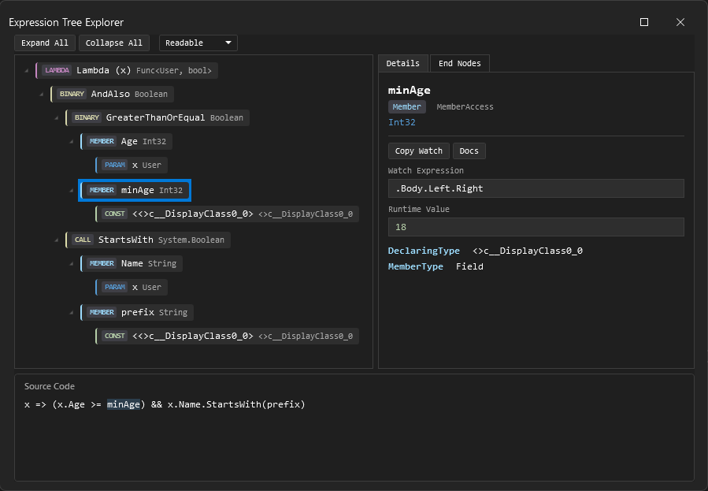

# Expression Tree Explorer

A Visual Studio debugger visualizer for C# expression trees.



## Description

Expression Tree Explorer is a debugger visualizer for `Expression<TDelegate>` variables. Open it from the debugger and the expression is broken into four linked views:

- **Tree view** — the full node tree with color-coded badges (node kind, `ExpressionType`, static type). Expand/collapse all from the toolbar.
- **Detail panel** — properties of the selected node (operator, method, member, lifted flags, runtime values), a watch expression you can copy, a **Copy Watch** button, and a link to the MS docs for that node type.
- **Source panel** — the expression as readable C#. Clicking a tree node highlights the matching span. Switch between ReadableExpressions, `ToString`, and DebugView from the toolbar.
- **End nodes tab** — a flat list of all terminal nodes: parameters, constants, closed-over variables, and defaults. Useful when the tree gets deep.


## Supported node types

Lambda, Binary, Member, Constant, Parameter, MethodCall, Unary, MemberInit, Conditional, New, TypeBinary, Invocation, NewArray, ListInit, Index, Default, Block, Try, Switch, Goto, Label, Loop. Everything else falls back to a generic node so the tree never fails to render.

## Getting started

1. Install from the Visual Studio Marketplace.
2. Set a breakpoint where you have an `Expression<TDelegate>` in scope:

   ```csharp
   int minAge = 18;
   string prefix = "A";
   Expression<Func<User, bool>> filter = x => x.Age >= minAge && x.Name.StartsWith(prefix);
   ```

3. Hover over the variable, click the magnifier, pick **Expression Tree Explorer**.

## Requirements

- Visual Studio 2022 (17.9+) or Visual Studio 2026, any edition.
- The variable must be statically typed as `Expression<TDelegate>` (plain `Expression` or `LambdaExpression` won't trigger the visualizer).

## Limitations

The extension uses the VisualStudio.Extensibility out-of-process model (Remote UI), which has a few hard limits:

- Source highlighting is one-way: tree -> source. You can't click in the source panel to select a node.
- Only C# output (ReadableExpressions doesn't support VB.NET).
- Runtime value extraction only reads `ConstantExpression.Value` and closure fields. No user code is executed.
- No multi-select and no "open in new window" (Remote UI doesn't support either).

## Privacy

Everything runs locally. The expression tree is serialized inside your debuggee process and displayed in Visual Studio. No telemetry or network calls.

## Project structure

| Project | Role |
|---|---|
| `ExpressionTreeExplorer.ObjectSource` (`netstandard2.0`) | Runs in the debuggee, serializes the expression into a payload |
| `ExpressionTreeExplorer.Core` (`netstandard2.0`) | Tree builder, formatters, watch expression generator |
| `ExpressionTreeExplorer.Vsix` (`net8.0-windows`) | Debugger visualizer host, Remote UI (XAML) |
| `ExpressionTreeExplorer.SampleApp` (`net8.0`) | Console app with sample expressions for local debugging |
| `ExpressionTreeExplorer.Tests` (`net8.0`) | Unit and snapshot tests for Core logic |

*`SampleApp` and `Tests` are not part of the extension, they exist only for local development.

## Credits

- Readable C# output is generated by [AgileObjects.ReadableExpressions](https://github.com/agileobjects/ReadableExpressions) (MIT).
- Main inspiration for this project was [ExpressionTreeVisualizer](https://github.com/zspitz/ExpressionTreeVisualizer) by [Zev Spitz](https://github.com/zspitz).


## References 
- [Debugger visualizers (VisualStudio.Extensibility)](https://learn.microsoft.com/en-us/visualstudio/extensibility/visualstudio.extensibility/debugger-visualizer/debugger-visualizers)
- [Remote UI (VisualStudio.Extensibility)](https://learn.microsoft.com/en-us/visualstudio/extensibility/visualstudio.extensibility/inside-the-sdk/remote-ui)

## License

[MIT](LICENSE) © Tomáš Pečinka
